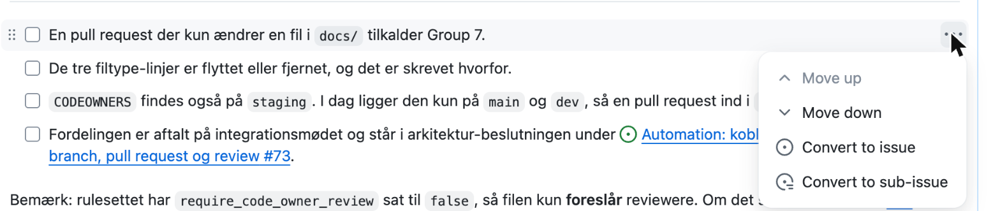

# Opret et issue

Navngivning og titler står i [`CONTRIBUTING.md`](../CONTRIBUTING.md).
Statusser, visninger og koblingen til en pull request står i [`working-on-issue.md`](working-on-issue.md).

## Sådan gør du

### Vælg board

| Board | Her ligger | Adresse |
|---|---|---|
| Case A. Emergency Scenarios | Produktets backlog: `MET-A-xxx` og deres sub-issues | [projects/3](https://github.com/orgs/aau-cph-sw5/projects/3) |
| Management | Driften af projektet: repo- og værktøjs-opsætning, mødenoter, præsentationer | [projects/10](https://github.com/orgs/aau-cph-sw5/projects/10) |

### Opret issuet

```bash
gh issue create --web
```

Browseren åbner på skabelon-vælgeren. Vælg en skabelon fra tabellen nedenfor og udfyld felterne. Mærkatet `case:A` sættes af skabelonen.

Skabelonerne er YAML-formularer, så de kan ikke udfyldes fra terminalen.

| Skabelon | Brug den til | Felter den kræver |
|---|---|---|
| Product Backlog Item | Et nyt item: feature, teknisk arbejde, research | User story, acceptkriterier, epic, track, type, størrelse, prioritet, herkomst |
| Sub-issue / Task | En delopgave under et eksisterende item | Beskrivelse og track |
| Defect Report | En fejl i Case A-løsningen | Beskrivelse, trin, forventet adfærd, track, alvorlighed |

### Skriv en tjekliste

1. Skriv `- [ ] ` foran hvert punkt i beskrivelsen.
2. Klik på boksen i issuet, når punktet er klaret. Den bliver `- [x]`.

### Lav et punkt i tjeklisten om til en sub-issue

1. Hold musen over punktet i issuet.
2. Klik på `...` til højre for punktet.
3. Vælg **Convert to sub-issue**.



## Hvad betyder

### Acceptkriterier

Formen er `Givet ... når ... så ...`. Hvert kriterium skal have **en målbar tærskel** og **det miljø, den måles i** — eller være en test med en opgave, et antal deltagere og en betingelse for succes.

Hvert kriterium skal kunne **fejle**. Et kriterium, som al leveret software opfylder, er ikke et kriterium.

Eksempel fra backloggen, `MET-A-004`:

> A scenario activated by an operator is reflected on a connected steward client **within 3 seconds at the 95th percentile**, measured **on staging with 25 simulated clients connected**.

Tærsklen er 3 sekunder ved 95. percentil. Miljøet er staging med 25 simulerede klienter. Begge dele skal stå der.

Disse formuleringer kan ikke fejle og er derfor ikke kriterier: `tydeligt markeret`, `visuelt adskilt`, `inden for få sekunder`, `brugervenligt`.

### Størrelser

| Størrelse | Svarer til |
|---|---|
| `XS` | Nogle timer for én person |
| `S` | Cirka én dag for én person |
| `M` | To til tre dage for et par. Den typiske størrelse på et velformet item |
| `L` | Det meste af en sprint for et par, eller cirka halvdelen af en sprint for holdet |
| `XL` | En hel sprint for hele holdet |
| `XXL` | Større end en sprint |

`XL` og `XXL` må ikke trækkes ind i en sprint. Split dem først.
