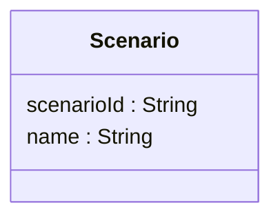
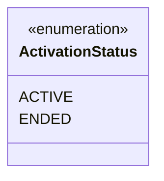
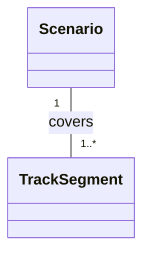
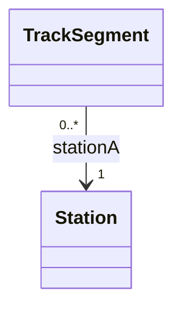
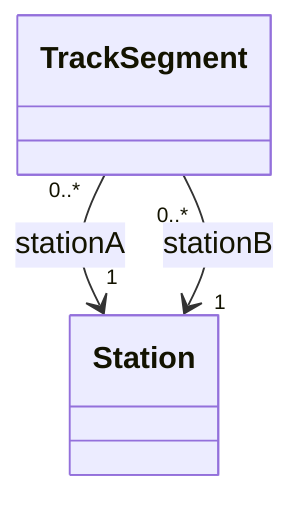
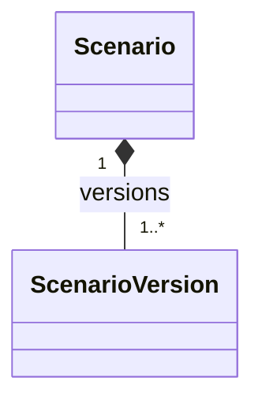
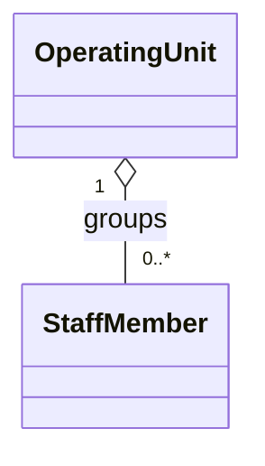
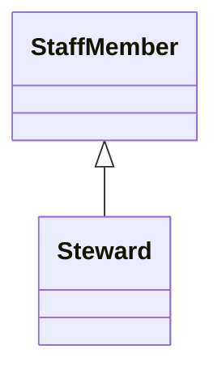
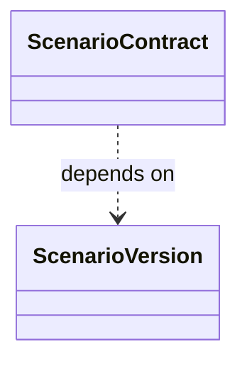

# Entity / Domain Model rules

The Entity / Domain Model describes the important concepts in the Case A domain and how they relate.

It uses UML class diagram notation as a conceptual modelling language.

It does not represent:

- implementation classes
- controllers or services
- database tables
- API endpoints
- UI components


## Concept / class

A class box represents a domain concept.

Example:



Attributes use:

```text
attributeName : Type
```

Examples:

```text
name : String
minimumStaffing : Int
startedAt : DateTime
```

Methods and implementation visibility such as `+`, `-` and `#` are normally not used in the domain model.

## Enumeration

An enumeration represents a fixed set of allowed values.

Example:



Project convention:

- domain concepts may use the normal entity styling
- enumerations may use the grey enum styling
- the meaning must not depend on colour alone

## Association

A normal association represents a structural relationship between two concepts.

Notation:

```text
--
```

Example:



Use a relationship name when it helps explain the meaning.

Good:

```text
covers
uses
station
versions
```

Avoid:

```text
related
link
connection
```

## Navigable association

A directed association shows that the relationship is intentionally navigable in one direction.

Notation:

```text
-->
```

Example:



This does not mean process flow or data flow.

Only show navigability when it adds useful information.

## Role names

Use role names when the same concepts are related in more than one way.

Example:



Do not rely on line placement alone to explain the difference.

## Multiplicity

Multiplicity describes how many instances may participate in a relationship.

| Notation | Meaning |
|---|---|
| `1` | exactly one |
| `0..1` | zero or one |
| `0..*` | zero or more |
| `1..*` | one or more |
| `2..*` | two or more |
| `m..n` | between m and n |

Example:


Read both ends of the relationship.

Do not guess multiplicities.

If the correct multiplicity is not known, add it to the open questions.

## Composition

Composition is a strong whole/part relationship.

Notation:

```text
*--
```

Example:



The filled diamond belongs to the whole.

Use composition when the part is strongly owned by the whole in the domain model.

Do not use composition only because one object contains another in code.

## Aggregation

Aggregation is a weaker whole/part relationship.

Notation:

```text
o--
```

Example:




Use a normal association unless the weaker whole/part meaning is important.

## Generalization

Generalization represents a true `is-a` relationship.

Example:



The triangle points toward the more general concept.

Do not use inheritance only because two concepts share similar attributes.

## Dependency

A UML dependency is a weaker relationship where one model element depends on another.

Notation:

```text
..>
```

Example:



Dependencies should be uncommon in the conceptual entity model.

Do not use this notation for project scheduling dependencies.

Cross-group project dependencies belong in the Integration Blooming Diagram.

## Focused views

A large entity model may be split into focused views.

For example:

1. permanent Metro network
2. planned scenario definition
3. live scenario activation

A focused view is a subset of the same model.

It must use the same:

- concept names
- relationships
- multiplicities
- attribute names
- enumeration values

Do not define the same relationship differently in two views.


## Documentation and traceability

Keep the diagram readable.

Do not add fake UML attributes such as:

```text
source = slide 7
assumption = true
```
Important assumptions and sources should be documented below the diagram.

Each model should normally contain:

1. the model
2. source naming
3. documentation for important or non-obvious concepts
4. attribute traceability where useful
5. modelling notes
6. a traceability overview
7. open questions

## Review checklist

- [ ] Concepts represent the domain, not code classes
- [ ] Attributes use `name : Type`
- [ ] Enumerations are identifiable
- [ ] Association types are used consistently
- [ ] Relationship names are meaningful
- [ ] Important multiplicities are shown
- [ ] Role names are used where needed
- [ ] Composition has a real ownership or lifecycle meaning
- [ ] Generalization represents a real `is-a` relationship
- [ ] M1/M2 and M3/M4 differences have not been silently averaged
- [ ] Assumptions are identified
- [ ] Source traceability exists
