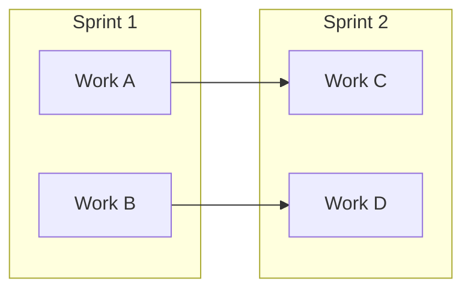
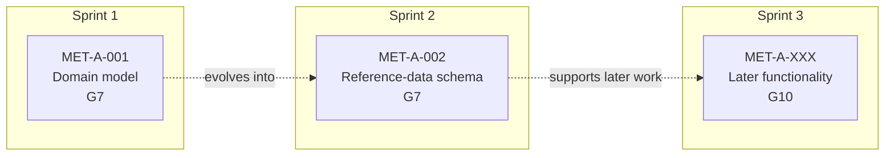
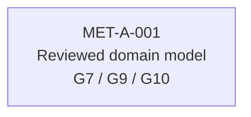
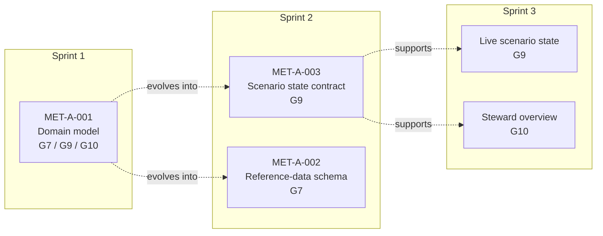
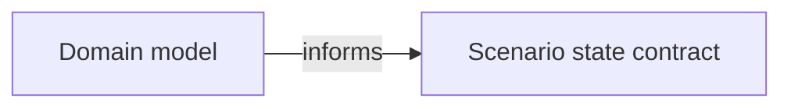
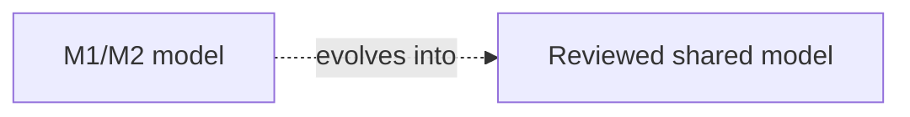
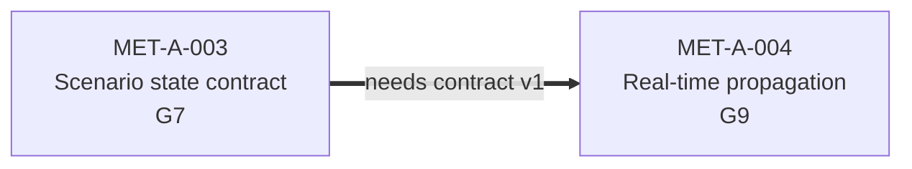
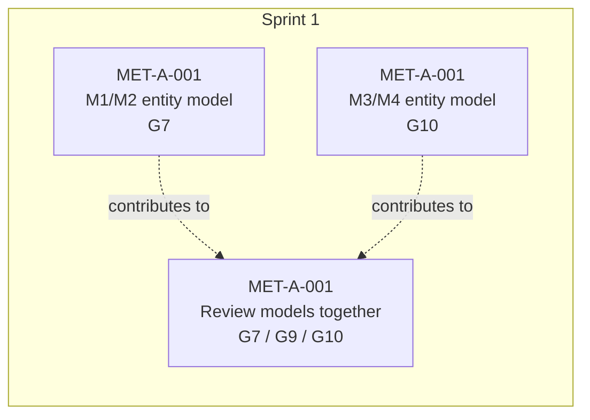

# Integration Evolving Model rules

The Integration Evolving Model shows how the Case A product grows over time.

It gives one shared view of:

- what was developed in each sprint
- which group worked on each part
- how later work grows from earlier work
- where work depends on another group
- what needs coordination before the next sprint

This is project and integration documentation.

It is not UML.


---

# 1. Time moves from left to right

The most important visual rule is:

> One sprint is one vertical column.

The full model reads from left to right:

```text
Sprint 1  ->  Sprint 2  ->  Sprint 3  ->  Sprint 4  -> ...
```

Use:

```mermaid
flowchart LR
```

Each sprint is represented by a Mermaid `subgraph`.

Example:



This makes the sprint boundaries visible immediately.

---

# 2. Each sprint is a separate area

Use:

```text
Sprint 1
Sprint 2
Sprint 3
```

as the subgraph titles.

Example:



Do not place Sprint 2 work inside the Sprint 1 area because it depends on Sprint 1.

The box belongs to the sprint where that work is actually done.

---

# 3. Work boxes

Each box represents a meaningful product outcome, model or integration artefact.

Use:

```text
PBI ID
Short title
Group
```

Example:

```text
MET-A-003
Scenario state contract
G9
```

For work that is a meaningful part of a PBI, the PBI number may be followed by the specific piece:

```text
MET-A-001
M1/M2 entity model
G7
```

Do not put every GitHub sub-issue into the diagram.

The model is a product evolution overview, not another backlog.

---

# 4. Group labels

Always show the group in the box.

Use:

```text
G7
G9
G10
```

For genuinely shared work:

```text
G7 / G9 / G10
```

Example:



Colour may make group ownership easier to scan, but colour must never be the only way ownership is communicated.

---

# 5. Show the product growing across sprints

The model should make it possible to follow a piece of the product through several sprints.

For example:



The reader should be able to visually follow the product becoming more complete from left to right.

---

# 6. Normal product relationship

A solid arrow means:

> This earlier artefact directly informs or feeds this later work.

Notation:

```text
-->
```

Example:



Use a short relationship label.

Good:

```text
informs
provides structure for
feeds
uses
```

---

# 7. Evolution relationship

A dashed arrow means:

> This later work grows from, refines or extends the earlier work.

Notation:

```text
-.-> 
```

Example:



An evolution relationship is not necessarily a blocker.

It explains how the product changed over time.

---

# 8. Cross-group dependency

A thicker dependency arrow means:

> This work needs a concrete output from another group before it can safely proceed.

Notation:

```text
==>
```

Always label the dependency with what is needed.

Example:



Good dependency labels:

```text
needs contract v1
needs agreed entity model
needs reference-data schema
needs scenario-state shape
needs agreed station assignment
```

Avoid:

```text
dependency
blocked
needs G7
```

The diagram should show what the dependency actually is.

---

# 9. Split work can converge later

One PBI may be explored in parallel by several groups.

For example, MET-A-001 can show separate M1/M2 and M3/M4 modelling before the work is reviewed together.



This is useful when several pieces of work contribute to one shared understanding.

---

# 10. Dependencies at the start of a sprint

The model should also help with planning the next sprint.

When a new sprint begins, look at the work planned in that sprint and ask:

```text
What does this work need from previous work?

Does another group own that thing?

Is it already available?

If not, when is it needed?
```

If another group must provide something, show that dependency before the work begins.

The detailed agreement still belongs in the relevant PBI and integration documentation.

The Integration Evolving Model gives the visual overview.

---

# 11. Work should bloom, not reset

The diagram should not look like each sprint contains unrelated work.

Where appropriate, show the connection between:

```text
Sprint 1 understanding
        |
        v
Sprint 2 structure
        |
        v
Sprint 3 functionality
        |
        v
later integrated product
```

This makes the incremental development visible.

---

# 12. Group ownership is sprint ownership

A label such as:

```text
G7
```

means:

```text
Group 7 worked on or coordinated this work at this point in the project.
```


# 13. Keep the boxes short

Good:

```text
MET-A-004
Real-time propagation
G9
```

Avoid:

```text
Implement real-time propagation of every scenario and position
change to all currently connected clients with full test coverage
G9
```

Details belong in the PBI.

---

# 14. Legend

Every maintained Integration Evolving Model should include the same legend.

| Notation | Meaning |
|---|---|
| `G7`, `G9`, `G10` | Group working on the item |
| `G7 / G9 / G10` | Shared work |
| Solid arrow | Directly informs or feeds |
| Dashed arrow | Evolves from or refines |
| Thick dependency arrow | Requires an output from another group |

---

# 15. Update the model throughout the semester

Review the model:

- during Sprint Planning
- when a new cross-group dependency appears
- during integration coordination
- when work changes group
- when a dependency is resolved
- when new work grows from an existing artefact

Do not reconstruct the diagram from memory when writing the report.

---

# Review checklist

- [ ] Each sprint has its own visible column
- [ ] Time reads from left to right
- [ ] Work inside each sprint is stacked vertically
- [ ] Work can be visually followed from one sprint to later sprints
- [ ] Every box has a short readable title
- [ ] Group ownership is written explicitly
- [ ] Shared work is labelled as shared
- [ ] Solid arrows are used for direct relationships
- [ ] Dashed arrows are used for evolution
- [ ] Thick arrows are used for cross-group dependencies
- [ ] Dependencies state what is needed
- [ ] The diagram does not duplicate the whole backlog
- [ ] Group ownership is not presented as permanent architecture ownership
- [ ] Current dependencies match the actual project
