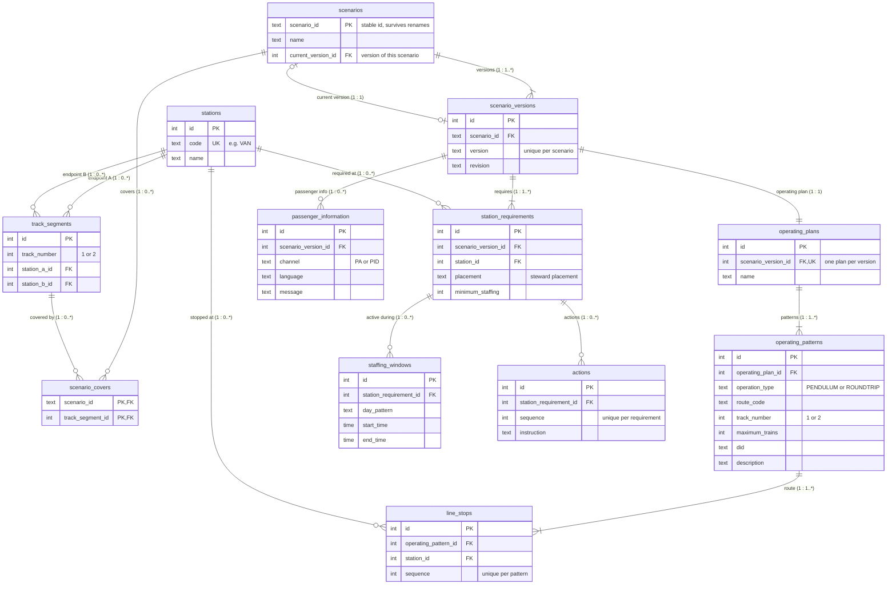

# Scenario ER Model

This document contains the Mermaid ER diagram for the scenario data model.

The domain concepts themselves are documented in the [Scenario Entity Model](/docs/diagrams/scenario-state-diagram/metro_scenario_entity_model_documented.md).

This document only describes what is added by the relational representation: **primary keys, foreign keys, uniqueness constraints, and how the relationships are implemented in the database**.

Two words recur below. A **track** is one of the two parallel rails of a line, 1 or 2. A **track segment** is the stretch of one track between two neighbouring stations.

---

## ER diagram



---

# Relational additions

## Keys

The ER model adds database identifiers and references that are not needed in the conceptual entity model.

- `PK` marks the primary key used to uniquely identify a row.
- `FK` marks a foreign key used to connect rows between tables.
- `UK` marks a unique key used to enforce a one-to-one relationship or another uniqueness rule.

`scenarios.scenario_id` remains the primary key because it is intended to be the stable scenario identifier.

`scenarios` is a central table in this part of the model. All other scenario-related entities connect back to a scenario either **directly or indirectly** through the relationship chain. For example, `scenario_versions` references `scenarios` directly, while `operating_patterns`, `line_stops`, `actions`, and `staffing_windows` are connected through their parent entities. This makes the stable `scenario_id` important because it anchors the rest of the stored scenario definition.

The remaining tables use integer `id` primary keys.

---

## Versioning

All scenario **content** belongs to a `scenario_versions` row, not to the scenario itself. The operating plan, station requirements and passenger information reference the version directly, and everything below them (patterns, line stops, staffing windows, actions) reaches the version through its parent.

When a scenario is revised, a new version is created with its own copy of the content. Older versions are never changed, so it is always possible to see exactly what a given version contained.

`stations` and `track_segments` are the exceptions: they describe the permanent, physical network and are shared by all scenarios and versions. A version only records *which* stations it uses.

---

## Relationships

The relationships from the entity model are implemented through foreign keys.

| Relationship | Database implementation |
|---|---|
| Scenario → ScenarioVersion | `scenario_versions.scenario_id` → `scenarios.scenario_id` |
| Scenario → current ScenarioVersion | `scenarios.current_version_id` → `scenario_versions.id` |
| Scenario → covered TrackSegment | `scenario_covers.scenario_id` → `scenarios.scenario_id` and `scenario_covers.track_segment_id` → `track_segments.id` |
| TrackSegment → Station (endpoints) | `track_segments.station_a_id` → `stations.id` and `track_segments.station_b_id` → `stations.id` |
| ScenarioVersion → OperatingPlan | `operating_plans.scenario_version_id` → `scenario_versions.id` |
| OperatingPlan → OperatingPattern | `operating_patterns.operating_plan_id` → `operating_plans.id` |
| OperatingPattern → LineStop | `line_stops.operating_pattern_id` → `operating_patterns.id` |
| LineStop → Station | `line_stops.station_id` → `stations.id` |
| ScenarioVersion → StationRequirement | `station_requirements.scenario_version_id` → `scenario_versions.id` |
| StationRequirement → Station | `station_requirements.station_id` → `stations.id` |
| StationRequirement → StaffingWindow | `staffing_windows.station_requirement_id` → `station_requirements.id` |
| StationRequirement → Action | `actions.station_requirement_id` → `station_requirements.id` |
| ScenarioVersion → PassengerInformation | `passenger_information.scenario_version_id` → `scenario_versions.id` |

The foreign keys turn the conceptual associations from the entity model into enforceable database relationships.


---

## Current version

`scenarios.current_version_id` points to the version of the scenario that is currently active, matching `currentVersion` in the scenario contract.

The reference is made together with `scenario_id`:

```sql
FOREIGN KEY (scenario_id, current_version_id)
    REFERENCES scenario_versions (scenario_id, id)
```

This ensures that a scenario can only point to one of its **own** versions, never to a version of another scenario.

---

## Covers

`covers` in the scenario contract is a **list of track segments** that the scenario covers. In a relational database a column holds a single value, so a list cannot be stored as one field on `scenarios`. Instead each item in the list becomes its own row in a separate table. This is the reason `scenario_covers` exists: it **is** the list of track segments a scenario covers.

For example, a scenario covering three segments is stored as three rows:

| scenario_id | track_segment_id |
|---|---|
| VAN-FB | 1 (VAN–FLI, track 1) |
| VAN-FB | 2 (FLI–LIT, track 1) |
| VAN-FB | 3 (LIT–SOT, track 1) |

The track segments themselves are stored once in `track_segments`, which describes a stretch of physical track between two stations:

```text
track_number
station_a_id FK
station_b_id FK
```

### Track segment rules

A track segment is part of the permanent network, like a station, so it exists only once. The two endpoints must be different stations, and the same segment cannot be registered twice, regardless of which station is stored as A and which as B:

```sql
CHECK (station_a_id <> station_b_id)

CREATE UNIQUE INDEX track_segments_unique
    ON track_segments (track_number, LEAST(station_a_id, station_b_id), GREATEST(station_a_id, station_b_id));
```

`covers` belongs to the scenario itself, not to a version, so it is not versioned.

---

## One operating plan per scenario version

The entity model states that a `ScenarioVersion` has one `OperatingPlan`.

In the ER model this is implemented with:

```text
operating_plans.scenario_version_id FK, UK
```

The foreign key links the plan to its scenario version, while the unique constraint prevents several operating plans from referencing the same version.

---

## Operating plan and operating pattern

An operating plan is how the trains run while a scenario version is active. Each scenario version has exactly one, in `operating_plans`, and the plan is made of one or more patterns, in `operating_patterns`.

An operating pattern is one way a set of trains runs within the plan. A pattern names the stretch it serves, as a route of stops in `line_stops`, the track it runs on, the number of trains at most, and its Destination ID (DID), the code the signalling uses for that run. It is one of two types:

- **`PENDULUM`**: a train shuttles back and forth on one stretch.
- **`ROUNDTRIP`**: a train runs out from its starting point and returns to it.

A plan with two patterns, for example, runs a pendulum on track 2 between the stations a closed segment cuts off, and a roundtrip on the rest of the line.

Source: `operatingPlan` and `patterns` in `contracts/v1/scenario.schema.json`, and the type descriptions in `docs/scenario-state/seedDataScenario_1_documentation.md`. The meaning of DID is an assumption from the hub's naming of the Destination ID spreadsheets and needs confirming with the contract owner.

---

## Track

Two columns name the physical track, and both hold 1 or 2.

| Column | Table | Meaning | Source |
|---|---|---|---|
| `track_number` | `track_segments` | The track a segment of line lies on | `TrackSegment.trackNumber` in the contract, an integer |
| `track_number` | `operating_patterns` | The track an operating pattern runs on | The pattern field `track` in the contract, the string `"1"` or `"2"` |

A segment belongs to one track, so a scenario that closes track 1 on one segment leaves track 2 open there. A pattern runs on one track, so a pattern on track 2 can serve the stations that the closed segment on track 1 no longer reaches.

The contract sends the pattern's track as a string, and the seed loader stores it as an integer. Both columns then share one name and one type, and a pattern's track compares directly with a segment's track without a cast. Decision taken in pull request 101; the contract itself is unchanged.

---

## Ordered route stops

`line_stops` represents a station's occurrence inside a specific operating pattern.

It contains:

```text
operating_pattern_id FK
station_id FK
```

This allows the same station to be reused across several operating patterns without duplicating the station itself.

The `sequence` field defines the order of stops inside a pattern and is unique within that pattern:

```sql
UNIQUE (operating_pattern_id, sequence)
```

---

## Stations and station requirements

`stations` and `station_requirements` are kept apart because they describe two different things:

- A **station** is a permanent, physical place (e.g. `VAN`). It is the same no matter which scenario is active.
- A **station requirement** is what one specific **scenario version** needs at that station: where stewards are placed, how many are needed, when (`staffing_windows`) and what they must do (`actions`).

A staffing window has a `start_time` and an `end_time`. When `end_time` is before `start_time`, the window crosses midnight: 22:00 to 02:00 runs from ten in the evening to two in the morning. A `CHECK` rejects a window whose two times are equal.

`station_requirements` therefore has two foreign keys, one to the version it belongs to and one to the station it applies to:

```text
station_requirements.scenario_version_id FK → scenario_versions.id
station_requirements.station_id FK          → stations.id
```

### Cardinality (1 : 0..*)

- Each station requirement applies to **exactly one** station.
- A station can have **zero or more** requirements, because the same station can be required by several scenarios and by every version of each scenario. For example, `VAN` can have one requirement in VAN-FB version 1.0, another in VAN-FB version 1.1, and a third in a different scenario. A station that no scenario requires has none.


---

## Steward placement and steward tasks

Steward placement is stored as a column (`station_requirements.placement`), while steward tasks are stored in a separate table (`actions`).

---

## Ordered actions

Actions are connected to a station requirement through:

```text
actions.station_requirement_id FK
```

Their `sequence` value defines the order of instructions for that requirement:

```sql
UNIQUE (station_requirement_id, sequence)
```

---

## Scenario version uniqueness

A version number only needs to be unique within its scenario:

```sql
UNIQUE (scenario_id, version)
```

This allows different scenarios to each have a `version 1`, while preventing duplicate version numbers for the same scenario.

---

## Shared station references

`stations` is referenced by:

```text
track_segments.station_a_id
track_segments.station_b_id
line_stops.station_id
station_requirements.station_id
```

This keeps the physical station as one shared record while track information stays in `track_segments`, route-specific information stays in `line_stops`, and scenario-specific staffing information stays in `station_requirements`.

Each station has a unique `code` (e.g. `VAN`), which is how the scenario contract refers to stations, so the same station cannot be registered twice. `name` holds the full station name (e.g. `Vanløse`) and is optional, since the contract does not provide it.

---

# Current scope

This ER diagram currently focuses on the persisted **scenario definition**.

It does not yet include all concepts from the Scenario Entity Model, such as the live activation/deployment and staffmember part of the model. Those can be added later when the persistence requirements for that part of the system are defined.

Station roles are not stored, as they are not part of the scenario-state-diagram or the scenario contract.
