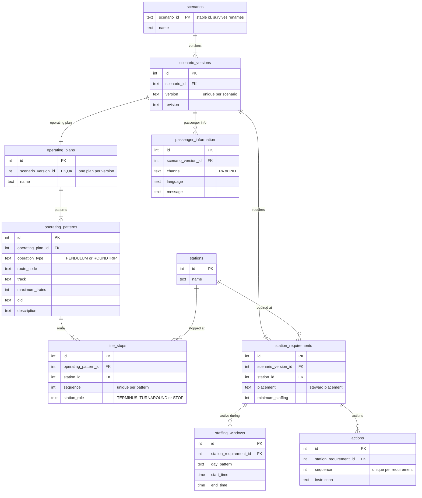

# Scenario ER Model

This document contains the Mermaid ER diagram for the scenario data model.

The domain concepts themselves are documented in the [Scenario Entity Model](https://github.com/aau-cph-sw5/case-a-emergency-scenarios/blob/diagramStructuring/docs/diagrams/scenario-state-diagram/metro_scenario_entity_model_documented.md?plain=1).

This document only describes what is added by the relational representation: **primary keys, foreign keys, uniqueness constraints, and how the relationships are implemented in the database**.

---

## ER diagram

---
