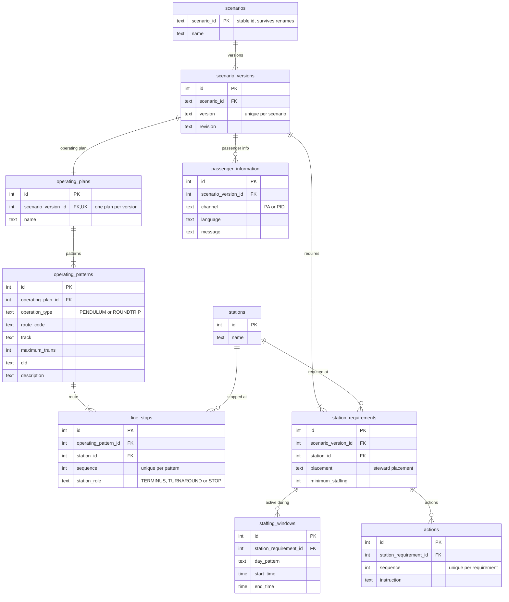

# Scenario ER Model

This document contains the Mermaid ER diagram for the scenario data model.

The domain concepts themselves are documented in the [Scenario Entity Model](https://github.com/aau-cph-sw5/case-a-emergency-scenarios/blob/diagramStructuring/docs/diagrams/scenario-state-diagram/metro_scenario_entity_model_documented.md?plain=1).

This document only describes what is added by the relational representation: **primary keys, foreign keys, uniqueness constraints, and how the relationships are implemented in the database**.

---

## ER diagram



---

# Relational additions

## Keys

The ER model adds database identifiers and references that are not needed in the conceptual entity model

- `PK` marks the primary key used to uniquely identify a row
- `FK` marks a foreign key used to connect rows between tables.
- `UK` marks a unique key used to enforce a one-to-one relationship or another uniqueness rule.

`scenarios.scenario_id` remains the primary key because it is intended to be the stable scenario identifier.

`scenarios` is a central table in this part of the model. All other scenario-related entities connect back to a scenario either **directly or indirectly** through the relationship chain. For example, `scenario_versions` references `scenarios` directly, while `operating_patterns`, `line_stops`, `actions`, and `staffing_windows` are connected through their parent entities. This makes the stable `scenario_id` important because it anchors the rest of the stored scenario definition.

The remaining tables use integer `id` primary keys.

---

## Relationships

The relationships from the entity model are implemented through foreign keys.

| Relationship | Database implementation |
|---|---|
| Scenario → ScenarioVersion | `scenario_versions.scenario_id` → `scenarios.scenario_id` |
| ScenarioVersion → OperatingPlan | `operating_plans.scenario_version_id` → `scenario_versions.id` |
| OperatingPlan → OperatingPattern | `operating_patterns.operating_plan_id` → `operating_plans.id` |
| OperatingPattern → LineStop | `line_stops.operating_pattern_id` → `operating_patterns.id` |
| LineStop → Station | `line_stops.station_id` → `stations.id` |
| ScenarioVersion → StationRequirement | `station_requirements.scenario_version_id` → `scenario_versions.id` |
| StationRequirement → Station | `station_requirements.station_id` → `stations.id` |
| StationRequirement → StaffingWindow | `staffing_windows.station_requirement_id` → `station_requirements.id` |
| StationRequirement → Action | `actions.station_requirement_id` → `station_requirements.id` |
| ScenarioVersion → PassengerInformation | `passenger_information.scenario_version_id` → `scenario_versions.id` |

The foreign keys turn the conceptual associations from the entity model into enforceable database relationships.

---

## One operating plan per scenario version

The entity model states that a `ScenarioVersion` has one `OperatingPlan`.

In the ER model this is implemented with:

```text
operating_plans.scenario_version_id FK, UK
```

The foreign key links the plan to its scenario version, while the unique constraint prevents several operating plans from referencing the same version.

---

## Ordered route stops and station roles

`line_stops` represents a station's occurrence inside a specific operating pattern.

It contains:

```text
operating_pattern_id FK
station_id FK
```

This allows the same station to be reused across several operating patterns without duplicating the station itself.

The `sequence` field defines the order of stops inside a pattern and should be unique within that pattern:

```sql
UNIQUE (operating_pattern_id, sequence)
```

### Station roles are stored in `line_stops`

`station_role` is explicitly stored on `line_stops`:

```text
station_role "TERMINUS, TURNAROUND or STOP"
```

The role belongs to the **station's occurrence in a specific operating pattern**, not to the station itself.

This is important because the same physical station can have different roles in different routes. For example, a station may be a normal `STOP` in one operating pattern and a `TURNAROUND` or `TERMINUS` in another.

Keeping `station_role` in `line_stops` therefore preserves route-specific behaviour without changing the shared `stations` record.

---

## Ordered actions

Actions are connected to a station requirement through:

```text
actions.station_requirement_id FK
```

Their `sequence` value defines the order of instructions for that requirement:

```sql
UNIQUE (station_requirement_id, sequence)
```

---

## Scenario version uniqueness

A version number only needs to be unique within its scenario:

```sql
UNIQUE (scenario_id, version)
```

This allows different scenarios to each have a `version 1`, while preventing duplicate version numbers for the same scenario.

---

## Shared station references

`stations` is referenced by both:

```text
line_stops.station_id
station_requirements.station_id
```

This keeps the physical station as one shared record while route-specific information, including `station_role`, stays in `line_stops`, and scenario-specific staffing information stays in `station_requirements`.

---

# Current scope

This ER diagram currently focuses on the persisted **scenario definition**.

It does not yet include all concepts from the Scenario Entity Model, such as the live activation/deployment part of the model. Those can be added later when the persistence requirements for that part of the system are defined.
