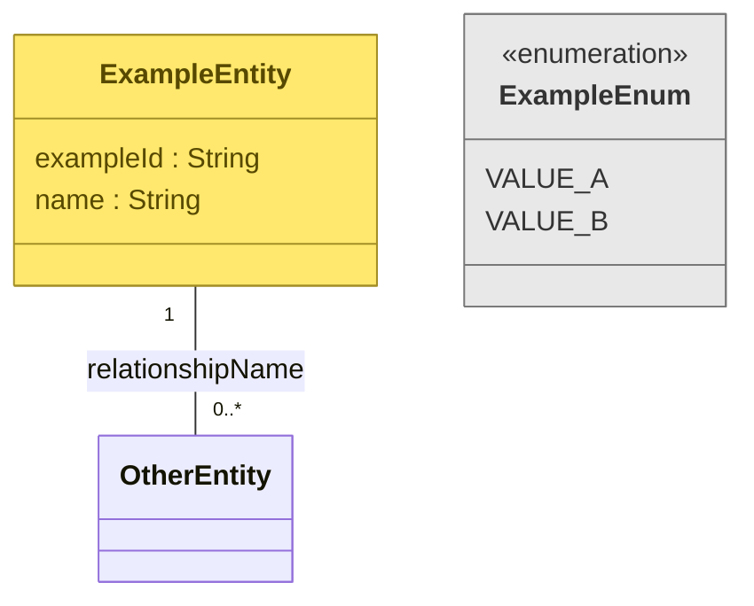

# {Scope} Entity Model

This document contains the conceptual Entity / Domain Model for `{scope}` together with traceability, assumptions and open questions.

The diagram uses UML class diagram notation.

Diagram rules:

[`../guides/entity-domain-model.md`](../guides/entity-domain-model.md)

## Entity model



# Documentation and traceability

## Source naming used in this document

**{Short source name}**

{Full source title or description}

**{Short source name}**

{Full source title or description}

## {Entity name}

### Purpose

{What this concept represents in the domain.}

### Source

**{Source name / PBI / stakeholder clarification}**

{What the source supports.}

### Attributes

| Attribute | Meaning | Traceability |
|---|---|---|
| `attribute : Type` | | Source-supported / Model decision / Assumption |
| | | |

### Relationships

```text
{Entity} -> {Entity} : {relationship}
```

{Explain anything that is not obvious from the diagram.}

### Modelling notes

{Assumptions, uncertainty or relevant modelling decisions.}

## {Next entity}

### Purpose

...

### Source

...

### Attributes

| Attribute | Meaning | Traceability |
|---|---|---|
| | | |

# Traceability overview

| Entity / enum | Source or assumption | Status |
|---|---|---|
| `{Entity}` | {source} | Source-supported |
| `{Entity}` | {reasoning} | Model decision |
| `{Entity}` | {assumption} | Needs confirmation |

# Open questions

1. ...
2. ...
3. ...
