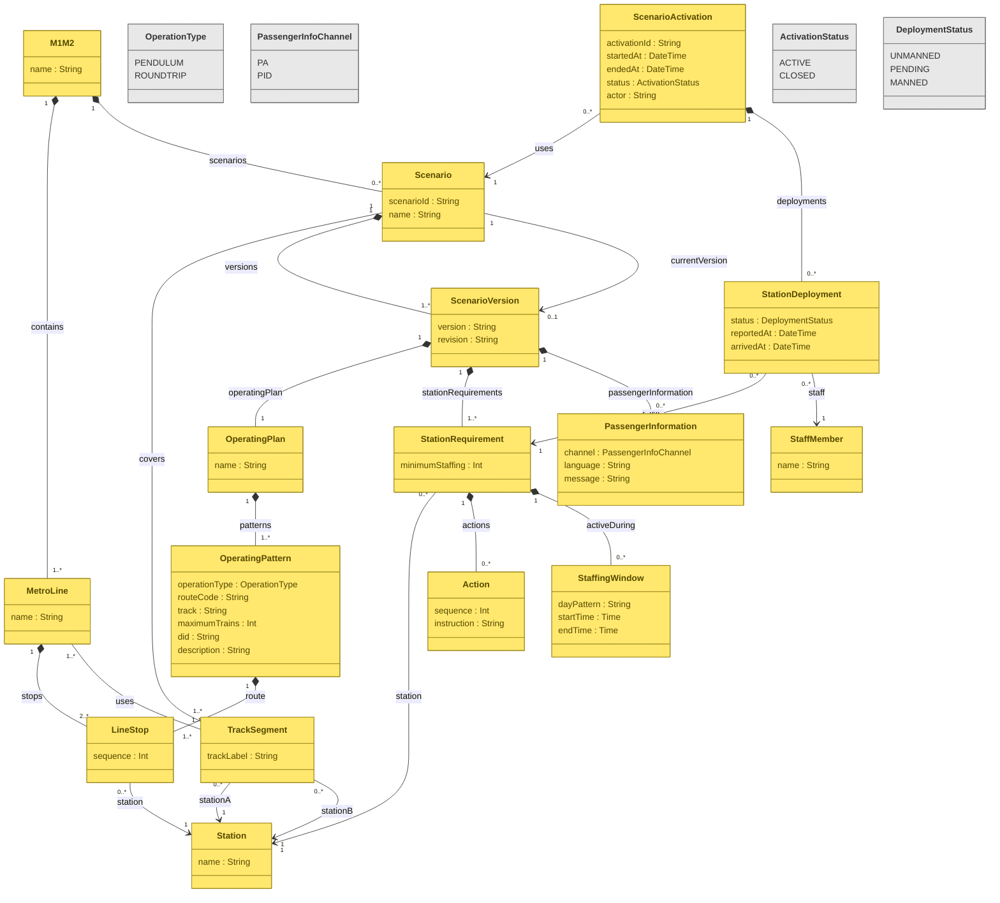

# M1/M2 Scenario Entity Model

This document contains the Mermaid entity model together with traceability and notes for each entity.  
The Mermaid diagram is kept focused on the data model; source references, assumptions, and open questions are documented below it instead of being stored as fake class attributes.

---

## Entity model


---

# Documentation and traceability

## Source naming used in this document

**FBS 1 VAN-FB-CCR**  
*Fallbackscenarie 1: VAN-FB - CCR - Fallbackscenarier.*

**FBS 1 VAN-FB-CCR-STW**  
*Fallbackscenarie 1: VAN-FB - CCR - Fallbackscenarier STW placering / STW opgaver.*

**Case A PowerPoint**  
Metro stakeholder presentation for Case A.

**MET-A-007**  
[Operator selects and activates a scenario from the predefined list](https://github.com/aau-cph-sw5/semester-docs/blob/main/backlog/case-a-emergency-scenarios.md#met-a-007--operator-selects-and-activates-a-scenario-from-the-predefined-list)

---

## ScenarioActivation

### Purpose

Represents one real activation of a predefined scenario.

The relationship

```text
ScenarioActivation --> Scenario : uses
```

identifies which predefined scenario was activated.

### Source

**MET-A-007**

The backlog states that activation writes an event to the incident log carrying the **actor** and **timestamp**.

### Attributes

| Attribute | Meaning | Traceability |
|---|---|---|
| `activationId : String` | Unique identifier for this particular activation. | Model decision. |
| `startedAt : DateTime` | Timestamp for when the scenario was activated. | Supported by MET-A-007 activation-event timestamp. |
| `endedAt : DateTime` | Timestamp for when the activation was closed. | Assumption / requires confirmation from a close/deactivation requirement. |
| `status : ActivationStatus` | Whether the activation is currently active or closed. | Model decision based on lifecycle requirements. |
| `actor : String` | Work ID of the operator who activated the scenario. | MET-A-007 states the actor is written to the incident log. |

### Identifier note

`scenarioId` should remain an attribute of `Scenario`, not the identifier of `ScenarioActivation`.

An activation needs its own identifier because the same scenario may be activated multiple times.

For example:

```text
Scenario:
scenarioId = "VAN-FB"

ScenarioActivation:
activationId = "VAN-FB-2026-09-22-001"
```

The exact format is an implementation decision. It could instead be a UUID or database-generated ID. The important part is that the `ScenarioActivation -> Scenario` relationship tells us which scenario was activated.

---

## PassengerInformation

### Purpose

Stores passenger-facing information belonging to a scenario version.

### Source

**FBS 1 VAN-FB-CCR, pages 3–4**

The material contains passenger announcements, for example a PA message informing passengers that they must change trains at Frederiksberg and that travel time between VAN and FB may be longer.

### Attributes

| Attribute | Meaning | Traceability |
|---|---|---|
| `channel : PassengerInfoChannel` | Where the information is presented. | PA/PID are present in the source material. |
| `language : String` | Language of the message, e.g. Danish or English. | Source contains passenger information in language-specific form. |
| `message : String` | The actual passenger-information text. | Directly supported by the passenger announcement material. |

### Channel

```text
PA  = Passenger Announcement
PID = Passenger Information Display
```

`channel` should therefore be kept.

### Language note

A Boolean should **not** be used for language. A Boolean such as `isDanish` becomes unclear as soon as another language is introduced.

For now `String` is acceptable. An enum could later be introduced, for example:

```text
DA
EN
```

---

## ScenarioVersion

### Purpose

Represents a specific version/revision of an emergency scenario definition.

### Source status

**Assumption based on the Metro stakeholder presentation.**

The stakeholder discussion indicated problems when steward-facing material does not align with newly changed emergency plans, and also discussed being able to return to previous versions.

This needs confirmation with the stakeholder before it is treated as a confirmed domain requirement.

### Attributes

| Attribute | Meaning |
|---|---|
| `version : String` | Version identifier/number. |
| `revision : String` | Description of what changed in this version. |

---

## StationAssignment

### Purpose

Represents the station-specific staffing requirement and task list for a scenario version.

### Sources

**FBS 1 VAN-FB-CCR, page 1**

Shows which stations must be manned during the fallback scenario.

**FBS 1 VAN-FB-CCR-STW**

Provides the staffing requirement for individual stations and the steward tasks associated with those stations.

**Case A PowerPoint, slides 5–7**

Shows station manning visually, including stations that are unmanned, pending, or manned.

### Attributes

| Attribute | Meaning | Traceability |
|---|---|---|
| `status : DeploymentStatus` | Current station staffing state. | Based on the live manning state shown in Case A. |
| `reportedAt : DateTime` | Time at which a steward reports/checks in for the assignment. | Assumption from the proposed digital workflow. |
| `arrivedAt : DateTime` | Time at which a steward arrives and the station becomes manned. | Assumption from the proposed digital workflow. |
| `minimumStaffing : Int` | Minimum number of stewards needed at the station. | Supported by station staffing requirements in the scenario material. |

### DeploymentStatus

```text
UNMANNED
PENDING
MANNED
```

These values represent the live staffing state shown in the proposed workflow.

### Modelling note

`minimumStaffing` is scenario-definition data, while `status`, `reportedAt`, `arrivedAt`, and assigned `StaffMember` are live activation data.

The current model keeps them together for simplicity. If the same scenario can be activated multiple times and historical activation state must be preserved, these live fields should later be moved to a separate activation/deployment entity.

---

## StaffingWindow

### Purpose

Defines periods in which a particular station staffing requirement applies.

### Source

**FBS 1 VAN-FB-CCR-STW**

Some stations are only required to be manned during specific periods, for example:

```text
Man-tor: 7-9 og 14-18
Fre:     7-9 og 13-19
```

### Attributes

| Attribute | Meaning |
|---|---|
| `dayPattern : String` | Day or day range, for example `Man-tor`. |
| `startTime : Time` | Start of the staffing interval. |
| `endTime : Time` | End of the staffing interval. |

A station can have multiple `StaffingWindow` entries because a single day pattern may have more than one interval.

---

## StaffMember

### Purpose

Identifies the steward currently assigned to a station.

### Source status

**Assumption based on the Metro stakeholder presentation.**

The stakeholder briefly mentioned that it would be useful to know which steward is manning a station so that the person can be contacted.

This should be confirmed with the stakeholder.

### Attributes

| Attribute | Meaning |
|---|---|
| `name : String` | Name of the steward. |

A future version may require a work ID or another contact identifier instead of, or in addition to, the name.

---

## Action

### Purpose

Stores the station-specific tasks that a steward/operator must carry out.

### Source

**FBS 1 VAN-FB-CCR-STW**

Each staffed station contains a list of instructions/tasks.

### Attributes

| Attribute | Meaning |
|---|---|
| `sequence : Int` | Defines the order/prioritisation of the task. |
| `instruction : String` | The instruction to carry out. |

Example tasks in the material include putting on a yellow vest, making passenger announcements, directing passengers, and emptying trains.

---

## OperatingPlan

### Purpose

Represents the complete operating solution for a scenario version.

An `OperatingPlan` contains one or more `OperatingPattern` entries.

### Source status

The operating solution is present in **FBS 1 VAN-FB-CCR**.

`OperatingPlan` itself is a modelling abstraction used to group the individual operating patterns into one scenario solution.

---

## OperatingPattern

### Purpose

Represents one train-operation pattern within an operating plan.

For example, one pattern may describe a pendulum operation between two points while another pattern describes the remaining train service.

### Source

**FBS 1 VAN-FB-CCR**

### Attributes

| Attribute | Meaning | Traceability |
|---|---|---|
| `operationType : OperationType` | Type of service, e.g. pendulum. | Pendulum operation is explicitly present in the VAN-FB material. |
| `routeCode : String` | Route/section, e.g. `VAN-FB`. | Derived from the operating-plan material. |
| `track : String` | Track used by the operating pattern. | Present in the operational material. |
| `maximumTrains : Int` | Maximum number of trains for the pattern. | Present in the operational material; exact interpretation should be confirmed where the source gives a range. |
| `did : String` | Destination ID used for the train operation. | Present in the CCR operating material. |
| `description : String` | Additional explanation of the operating pattern. | Model field; optional unless required by the source. |

### OperationType

```text
PENDULUM
ROUNDTRIP
```

`PENDULUM` is supported by the VAN-FB fallback material.

`ROUNDTRIP` should remain marked for confirmation unless a specific M1/M2 source explicitly uses that term.

---

## TrackSegment

### Purpose

Represents one physical track between two stations.

A scenario can cover one or more track segments.

### Sources

**FBS 1 VAN-FB-CCR, page 3**

**Case A PowerPoint, page/slide 7**

### Attributes

| Attribute | Meaning |
|---|---|
| `trackLabel : String` | Identifier/label for the physical track. |

The endpoints are represented through the relationships:

```text
TrackSegment --> Station : stationA
TrackSegment --> Station : stationB
```

---

# Open questions for stakeholder review

1. Is scenario versioning and rollback a required system feature, and what exactly constitutes a new `ScenarioVersion`?
2. Should live staffing state remain on `StationAssignment`, or should it be separated from the predefined station requirement so each activation has independent history?
