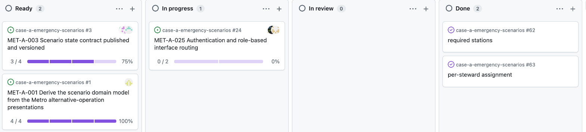

# Arbejd på et issue

Sådan opretter du et issue står i [`create-issue.md`](create-issue.md).
Branch, PR-titel og review-reglerne står i [`CONTRIBUTING.md`](../CONTRIBUTING.md).

## Sådan gør du

### Begynd på et issue

```bash
gh issue develop 42 --base dev --checkout
```

Branchen oprettes fra `dev`, kobles til issue 42, og du står på den. `gh issue develop 42 --list` viser, hvilke brancher der allerede hænger på issuet.

### Åbn pull requesten

```bash
git push -u origin HEAD
gh pr create --base dev
```

Pull requesten er koblet til issue 42, fordi branchen er. Du skal ikke vælge noget under **Development**.

### Flyt issuet til Done

Træk kortet på boardet, når pull requesten er merget. `gh project item-edit` kan det også, men kræver fire identifikatorer du selv skal slå op, så det er hurtigere at trække.



## Hvad betyder

### Statusser

| Status | Hvem sætter den | Hvornår |
|---|---|---|
| `Backlog` | Boardet | Issuet oprettes eller tilføjes boardet |
| `Ready` | Dig | Ved refinement, når Definition of Ready er opfyldt |
| `In progress` | Dig | Når du begynder at arbejde |
| `Blocked` | Dig | Når issuet venter. Sæt også mærkatet `status:blocked`, og `needs:metro` hvis det venter på Metro |
| `In review` | Boardet | Når pull requesten linkes til issuet |
| `Done` | Dig | Når pull requesten er merget og hvert acceptkriterium er demonstreret |

### Visninger på Case A-boardet

**`All Items`**: alle top-level issues med status, assignees, linkede pull requests og fremdrift på sub-issues.
**`Overview - parent/child`**: hierarkiet mellem issues og deres sub-issues.
**`Kanban - Items`**: grupperet efter status.
**`Sub-issues`**: kun sub-issues, holdt væk fra hovedoversigten.
**`My items`**: kun det, der er tildelt dig.
**`group-7`, `group-9`, `group-10`**: én visning per gruppe. Ikke alle er sat på endnu.

### Visninger på Management-boardet

**`Backlog`**: møde-issues med status `MØDER` som parent, med aftaler fra mødet som sub-issues.
**`Board`**: kolonnerne `MØDER`, `Todo`, `In progress`, `Done`.
**`Current iteration`**: kun det aktive i denne sprint.
**`Roadmap`**: tidslinje over items.
**`My items`**: kun det, der er tildelt dig.

### Nøgleord, der ikke virker her

**`Closes #42`**: fortolkes ikke. GitHub læser nøgleordet kun i en pull request mod repoets standard-branch, og den er `main`, mens vores pull requests peger på `dev`. Derfor skal issuet trækkes til **Done** i hånden.
