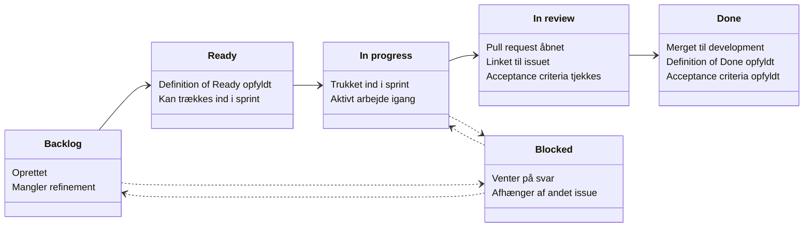

# Issue Guidelines

Vi bruger to fælles boards på tværs af alle tre teams, der bygger Case A.

<table>
<tr><td><b>Project: Case A. Emergency Scenarios</b></td><td></td></tr>
<tr><td>Produktets backlog. Her ligger MET-A-xxx-issues: de features, der udgør selve produktet, samt de sub-issues vi opretter til givens items, med gode og korrekte parent/children relationer.</td><td>https://github.com/orgs/aau-cph-sw5/projects/3</td></tr>
</table>

<table>
<tr><td><b>Project: Management</b></td><td></td></tr>
<tr><td>Til administrative opgaver: alt der handler om at drive projektet i sig selv frem for produktet, fx repo/tooling-opsætning, mødenoter og præsentationer.</td><td>https://github.com/orgs/aau-cph-sw5/projects/10</td></tr>
</table>

## Hvordan ser en god issue ud?

### Hvad er en god title?

<table>
<tr><td><b>Kort og specifik</b></td></tr>
<tr><td>Beskriver hvad der skal ske, ikke hvordan. Fx <code>Vis aktive hændelser på kort</code> frem for <code>Kort-feature</code> eller <code>Fix kort</code>.</td></tr>
<tr><td><b>Issues</b></td></tr>
<tr><td>Starter med backlog-nummeret efterfulgt af titlen. Fx <code>MET-A-003 Scenario state contract published and versioned</code>.</td></tr>
<tr><td><b>Sub-issues</b></td></tr>
<tr><td>Navngives <code>Sub-issue of MET-A-xxx (kort beskrivelse)</code>. Fx <code>Sub-issue of MET-A-003 (Stub server)</code>. Så kan man altid se, hvilket parent-issue en sub-issue hører til, også uden for boardet.</td></tr>
</table>

### Hvad er en god beskrivelse med success-kriterier? og hvorfor

<table>
<tr><td><b>User story</b></td>
<tr><td>Hvem får gavn af det, og hvorfor.</td>
<tr><td><b>Acceptance criteria</b></td>
<tr><td>Konkrete punkter, der hver kan testes og fejle isoleret - ikke vage formuleringer.</td>
<tr><td><b>Done</b></td>
<tr><td>Når alle kriterier er opfyldt, er issuet Done.</td>
</table>

### Husk nu

<table>
<tr><td>
<ul>
<li>Husk at oprette sub-issues under det relevante parent-issue, så de kobles rigtigt og tælles med i parent-kortets fremdrift.</li>
<li>Husk selv at rykke status aktivt - der er ingen automatik ud over at sub-issues auto-tilføjes til boardet.</li>
<li>Husk at sætte <code>status:blocked</code> og/eller <code>needs:metro</code>, hvis issuet venter på noget.</li>
<li>Husk at flytte til "In review" når PR'en åbnes, og til "Done" når den er merget og alle acceptance criteria er demonstreret.</li>
<li>Husk at PR'en skal linkes til det relevante issue eller sub-issue.</li>
</ul>
</td><td></td></tr>
</table>

## Issue og Sub-issue livs cyklus

Sådan bevæger et issue sig gennem de forskellige statusser, fra det oprettes til det er Done.

### Pull requests skal linkes til deres issue

<table>
<tr><td><b>Hvorfor</b></td></tr>
<tr><td>Når en pull request linkes til det issue eller sub-issue, den løser (fx via <code>Closes #123</code> i PR-beskrivelsen), kan reviewer med det samme se user story og acceptance criteria uden at spørge - og issuet flyttes automatisk til Done, når PR'en merges.</td></tr>
</table>

## Views

**Case A: Emergency Scenarios**

<table>
<tr><td><b>All Items</b></td><td><b>Overview - parent/child</b></td><td><b>Kanban - Items</b></td><td><b>Sub-issues</b></td><td><b>My items</b></td></tr>
<tr><td>Fuld liste over alle top-level issues med status, assignees, linkede pull requests og sub-issues progress.</td><td>Viser parent/child-hierarkiet mellem issues og deres sub-issues.</td><td>Selve Kanban-visningen, grupperet efter status: Backlog, Ready, In progress, Blocked, In review, Done.</td><td>Separat visning for sub-issues, holdt væk fra hovedoversigten - de bevæger sig gennem de samme statusser.</td><td>Kun de items, der er tildelt dig selv.</td></tr>
</table>

Derudover findes der gruppe-visninger (fx <code>group-7</code>, <code>group-9</code>, <code>group-10</code>) - én pr. team. Det er ikke sikkert, at alle fra ens gruppe er sat på endnu, så det kan være nødvendigt selv at oprette eller justere sin gruppes visning løbende.

**Management**

<table>
<tr><td><b>Backlog</b></td><td><b>Board</b></td><td><b>Current iteration</b></td><td><b>Roadmap</b></td><td><b>My items</b></td></tr>
<tr><td>Holder møde-issues (status MØDER) som parent-issues, med sub-issues oprettet ud fra aftaler fra de pågældende møder.</td><td>Selve Kanban-visningen med kolonnerne MØDER, Todo, In progress og Done.</td><td>Kun det, der er aktivt i den nuværende iteration/sprint.</td><td>Tidslinje-visning af items over tid.</td><td>Kun de items, der er tildelt dig selv.</td></tr>
</table>
