# Issue Guidelines

Vi bruger to fælles boards på tværs af alle tre teams, der bygger Case A.

<table>
<tr><td><b>Project: Case A. Emergency Scenarios</b></td><td></td></tr>
<tr><td>Produktets backlog. Her ligger MET-A-xxx-issues: de features, der udgør selve produktet, samt de sub-issues vi opretter til givne items, med gode og korrekte parent/children relationer.</td><td>https://github.com/orgs/aau-cph-sw5/projects/3</td></tr>
</table>

<table>
<tr><td><b>Project: Management</b></td><td></td></tr>
<tr><td>Til administrative opgaver: alt der handler om at drive projektet i sig selv frem for produktet, fx repo/tooling-opsætning, mødenoter og præsentationer.</td><td>https://github.com/orgs/aau-cph-sw5/projects/10</td></tr>
</table>

## Opret issues via templates

Brug altid "New issue" eller "Create sub-issue" og vælg en template. Så får du de rigtige felter, og labelen <code>case:A</code> sættes automatisk. Læs CONVENTIONS.md i semester-docs, før du opretter et issue.

<table>
<tr><td><b>Product Backlog Item</b></td><td><b>Sub-issue / Task</b></td><td><b>Defect Report</b></td></tr>
<tr><td>Et nyt PBI: feature, tech-arbejde, spike osv. Kræver user story, acceptance criteria, epic, track, type, størrelse, prioritet og herkomst.</td><td>En mindre delopgave under et eksisterende PBI, ikke et selvstændigt backlog-item. Kræver kun "Færdig når" og track.</td><td>Rapportér en fejl i Case A-løsningen.</td></tr>
</table>

## Hvordan ser en god issue ud?

### Hvad er en god title?

<table>
<tr><td><b>Kort og specifik</b></td></tr>
<tr><td>Beskriver hvad der skal ske, ikke hvordan. Fx <code>Vis aktive hændelser på kort</code> frem for <code>Kort-feature</code> eller <code>Fix kort</code>.</td></tr>
<tr><td><b>Issues</b></td></tr>
<tr><td>Starter med backlog-nummeret efterfulgt af titlen. Fx <code>MET-A-003 Scenario state contract published and versioned</code>.</td></tr>
<tr><td><b>Sub-issues</b></td></tr>
<tr><td>Templaten udfylder <code>Sub-issue of:</code> for dig. Skriv parent-issuets nummer og en kort beskrivelse i parentes efter. Fx <code>Sub-issue of MET-A-003 (Stub server)</code>. Så kan man altid se, hvilket parent-issue en sub-issue hører til, også uden for boardet.</td></tr>
</table>

### Hvad er en god beskrivelse med success-kriterier? og hvorfor

<table>
<tr><td><b>User story (PBI)</b></td></tr>
<tr><td>Skrives <code>Som &lt;rolle&gt; vil jeg &lt;mål&gt; så &lt;værdi&gt;</code>. Fx <code>Som steward vil jeg se min egen position på kortet, så jeg kan navigere til hændelsen uden radiokontakt</code>.</td></tr>
<tr><td><b>Acceptance criteria (PBI)</b></td></tr>
<tr><td>Hvert kriterium skal kunne testes og kunne fejle.
<code>Givet ... når ... så ...</code> er en god form til adfærdskriterier.
Målbare krav skal angive tærskel og betingelser/miljø.
Bruger- eller usabilitykrav kan i stedet beskrives som en testprotokol med opgave,
sample/deltagere og en tydelig success condition.
Undgå vage formuleringer som "hurtig", "brugervenlig" eller "tydelig", medmindre det
er gjort målbart.
</td></tr>
<tr><td><b>Størrelse</b></td></tr>
<tr><td>XL og XXL må ikke trækkes ind i en sprint, før de er splittet. Split dem op i sub-issues før sprintet. Hvis det stadig er ét samlet produkt-outcome, kan parent-PBI'et blive stående som
overordnet item, mens arbejdet opdeles i mindre sub-issues med tydeligt ansvar.</td></tr>
<tr><td><b>Done</b></td></tr>
<tr><td>Et sub issue kan lukkes, når dets egne "Færdig når"-betingelser er opfyldt.

Et parent-PBI er først Done, når dets acceptance criteria er demonstreret og den
fælles Definition of Done er opfyldt.

At alle sub-issues er lukket gør ikke automatisk parent-PBI'et Done.
</td></tr>
</table>

### Brug tjeklister

Del arbejdet op i punkter, du kan krydse af. Så kan du og andre se, hvor langt et issue er, uden at åbne koden eller spørge.

<table>
<tr><td><b>Hvorfor</b></td></tr>
<tr><td>Du kan se med det samme, hvad der mangler. Andre kan følge med i fremdriften. Og GitHub viser fx <code>2 of 5 tasks</code> ved issuet i oversigten.</td></tr>
<tr><td><b>Hvor</b></td></tr>
<tr><td>I beskrivelsen af et issue eller sub-issue, fx under acceptance criteria eller "Færdig når". Det virker også i pull requests og kommentarer.</td></tr>
<tr><td><b>Sådan laver du en</b></td></tr>
<tr><td>Skriv <code>- [ ]</code> foran hvert punkt. Når punktet er klaret, klikker du bare på boksen i issuet, så bliver den til <code>- [x]</code>.</td></tr>
<tr><td><b>Fra punkt til sub-issue</b></td></tr>
<tr><td>Viser et punkt sig at være større end forventet, kan du holde musen over det og vælge "Convert to sub-issue". Så bliver det en sub-issue under det nuværende issue.</td></tr>
</table>

Eksempel på "Færdig når" i en sub-issue:

```markdown
- [ ] Stub serveren svarer på GET /scenarios
- [ ] Svaret følger scenario state contract v1
- [ ] README beskriver, hvordan serveren startes
```


### Husk nu

<table>
<tr><td>
<ul>
<li>Husk at oprette sub-issues under det relevante parent-issue, så de kobles rigtigt og tælles med i parent-kortets fremdrift.</li>
<li>Husk selv at rykke status aktivt. Nye issues sættes automatisk til Backlog, men resten af vejen skal du selv flytte dem.</li>
<li>Husk at sætte <code>status:blocked</code> og/eller <code>needs:metro</code>, hvis issuet venter på noget.</li>
<li>Husk at flytte til "In review" når pull requesten åbnes, og til "Done" når den er merget og alle acceptance criteria er demonstreret.</li>
<li>Husk at pull requesten skal linkes til det relevante issue eller sub-issue.</li>
</ul>
</td><td></td></tr>
</table>

## Issue og Sub-issue livs cyklus

Sådan bevæger et issue sig gennem de forskellige statusser, fra det oprettes til det er Done.

```mermaid
classDiagram
direction LR
    class Backlog {
        Oprettet
        Mangler refinement
    }
    class Ready {
        Definition of Ready opfyldt
        Kan trækkes ind i sprint
    }
    class InProgress["In progress"] {
        Trukket ind i sprint
        Aktivt arbejde igang
    }
    class InReview["In review"] {
        Pull request åbnet
        Linket til issuet
        Acceptance criteria tjekkes
    }
    class Done {
        Merget til development
        Definition of Done opfyldt
        Acceptance criteria opfyldt
    }
    class Blocked {
        Venter på svar
        Afhænger af andet issue
    }
    Backlog --> Ready
    Ready --> InProgress
    InProgress --> InReview
    InReview --> Done
    Backlog ..> Blocked
    Blocked ..> Backlog
    InProgress ..> Blocked
    Blocked ..> InProgress
```



### Pull requests skal linkes til deres issue

<table>
<tr><td><b>Hvorfor</b></td></tr>
<tr><td>Når en pull request linkes til det issue eller sub-issue, den løser (fx via <code>Closes #123</code> i PR-beskrivelsen), kan reviewer med det samme se user story og acceptance criteria uden at spørge - og issuet flyttes automatisk til Done, når PR'en merges.  Kontrollér stadig Project-status bagefter. Et issue må kun stå som Done, når den relevante Definition of Done faktisk er opfyldt</td></tr>
</table>


## Views

**Case A: Emergency Scenarios**

<table>
<tr><td><b>All Items</b></td><td><b>Overview - parent/child</b></td><td><b>Kanban - Items</b></td><td><b>Sub-issues</b></td><td><b>My items</b></td></tr>
<tr><td>Fuld liste over alle top-level issues med status, assignees, linkede pull requests og sub-issues progress.</td><td>Viser parent/child-hierarkiet mellem issues og deres sub-issues.</td><td>Selve Kanban-visningen, grupperet efter status: Backlog, Ready, In progress, Blocked, In review, Done.</td><td>Separat visning for sub-issues, holdt væk fra hovedoversigten. De bevæger sig gennem de samme statusser.</td><td>Kun de items, der er tildelt dig selv.</td></tr>
</table>

Derudover findes der gruppe-visninger (fx <code>group-7</code>, <code>group-9</code>, <code>group-10</code>), én pr. team. Det er ikke sikkert, at alle fra ens gruppe er sat på endnu, så det kan være nødvendigt selv at oprette eller justere sin gruppes visning løbende.

**Management**

<table>
<tr><td><b>Backlog</b></td><td><b>Board</b></td><td><b>Current iteration</b></td><td><b>Roadmap</b></td><td><b>My items</b></td></tr>
<tr><td>Holder møde-issues (status MØDER) som parent-issues, med sub-issues oprettet ud fra aftaler fra de pågældende møder.</td><td>Selve Kanban-visningen med kolonnerne MØDER, Todo, In progress og Done.</td><td>Kun det, der er aktivt i den nuværende iteration/sprint.</td><td>Tidslinje-visning af items over tid.</td><td>Kun de items, der er tildelt dig selv.</td></tr>
</table>
